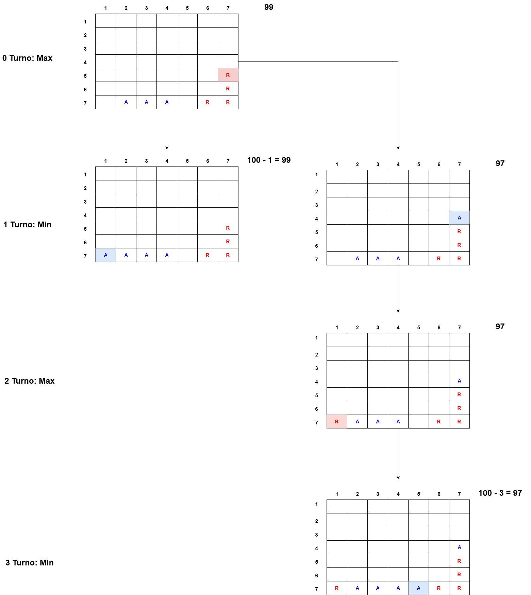
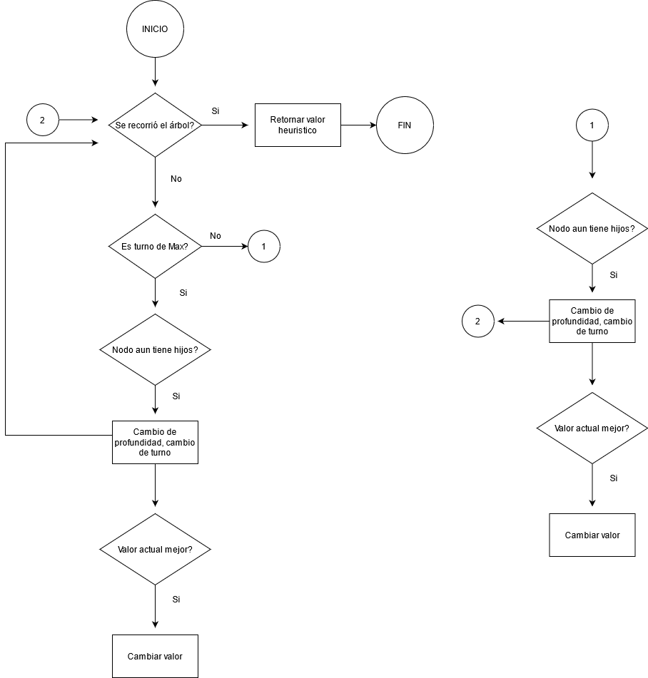

Algoritmo minimax: Este algoritmo recursivo, trabaja con un árbol de juego o decisiones, su objetivo es buscar la mejor jugada disponible para un jugador, suponiendo que el otro participante también realice la mejor jugada posible. Se le asigna a cada jugador un nombre, Mín y Máx. En cada nodo que se pueda terminar el juego, se calculará un valor negativo o positivo, según corresponda el turno(Min o Max) y su profundidad, se elegirá el mejor valor posible. Por ejemplo si es turno del Max, se elegirá el valor más grande disponible de los nodos.

En la siguiente imagen se presenta un caso hipotético, dado el turno de Max, este deberá elegir la mejor opción, es decir el nodo con el valor más alto, para ello se presentan dos posibles movimientos, uno le permite ganar en el siguiente turno, por lo cual sería la opción con un número más alto. Aun así, este ejemplo solo abarca un pequeño rango de posibilidades, esta idea se debe implementar de manera recursiva para que recorra todos las hojas del árbol. En resumen, el algoritmo visualiza todos los posibles movimientos hasta alcanzar un ganador o empate y selecciona la mejor opción para ganar .

El siguiente diagrama de flujo presenta la idea principal del algoritmo

